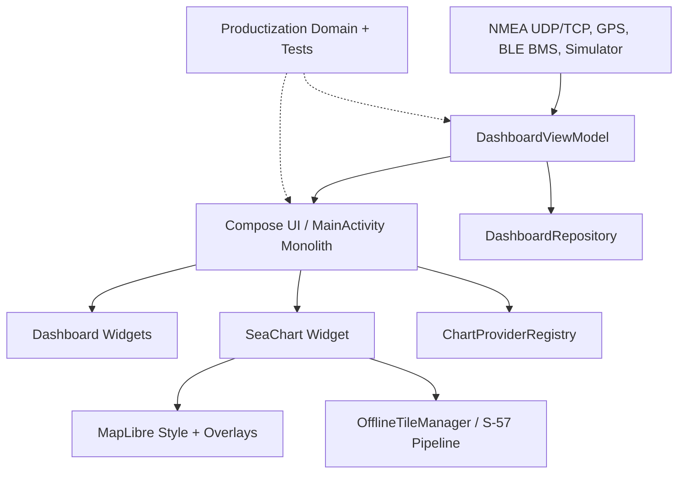

# seaFOX Architecture

## Summary

seaFOX ist eine einzelne Android-App. Die Hauptarchitektur laeuft von Borddatenquellen ueber ein zentrales ViewModel in eine Compose-Oberflaeche mit Widgets und einem spezialisierten Kartensubsystem. Persistenz liegt derzeit bei `SharedPreferences` plus versionierten Backups.

Der relevante Ist-Zustand fuer weitere Agenten: `MainActivity.kt` bleibt monolithisch und traegt weiter App-Start, grosse Teile der Compose-UI, Widget-Rendering, Menues, Karten-Settings und Download-Logik. Productization-Arbeit soll diese Realitaet respektieren und keine breiten, unkoordinierten Extraktionen erzwingen.

## System Flow

## Main Layers

- Data sources: `NmeaNetworkService`, Android `LocationManager`, `DalyBmsBleManager`, integrated simulator.
- State: `DashboardViewModel` exposes dashboard state and update flows for NMEA, AIS, GPS and autopilot dispatch.
- UI: `MainActivity` owns the broad Compose UI, pages, widget rendering, menus, chart settings and a large amount of chart download/source-selection glue.
- Persistence: `DashboardRepository` stores dashboard state and backups.
- Chart subsystem: `ChartWidget`, `ChartStyle`, `NauticalOverlay`, `AisOverlay`, `NavigationOverlay`, `OfflineTileManager`, `s57/`.
- Productization domain: `AutopilotSafetyGate`, `BackupPrivacyPolicy`, `SupportDiagnostics`, `EntitlementPolicy` and `BillingCatalog` provide tested policy/model contracts, but not all are end-to-end enforced in runtime UI.

## Current Architectural Truth

- `MainActivity.kt` is about 15.5k lines and remains the practical app shell. It is a known risk, but also the current integration point; the CEO sync explicitly warns against overlapping edits there without calling out the exact section first.
- `DashboardViewModel.kt` remains the central state holder for dashboard state, NMEA/AIS/GPS/autopilot flows, persisted settings and product-shell state such as backup privacy and boot autostart.
- `ChartProvider` exists as an interface for future unified chart providers. `ChartProviderRegistry` is wired into provider selection labels/availability and hides or gates C-Map/S-63, but the rendering/download path still mostly runs through `SeaChartMapProvider`, `ChartWidget`, local source discovery and existing MapLibre/S-57 helpers.
- Safety Contour has policy/filtering and overlay contracts, but still needs real ENC-derived rendering proof, fixtures and screenshots before being treated as release-ready.
- `EntitlementPolicy` and `BillingCatalog` are tested domain logic. They prepare Free/Pro/Navigator/Fleet tiers and active app subscription product IDs, while external chart license products are inactive placeholders. Play Billing, purchase restore, server validation and runtime premium gates are still future work.
- `SupportDiagnostics` now has builder, JSON serialization and internal file export contracts with JVM tests. Architecture-wise this is a support artifact layer; user-facing export/share flow, privacy review and triage workflow remain release gates.

## Build Configuration

- Android Gradle Plugin: `8.6.0`
- Kotlin Android plugin: `1.9.24`
- Compile SDK / Target SDK: `35`
- Min SDK: `24`
- Compose compiler extension: `1.5.14`
- MapLibre Android SDK: `11.8.4`
- osmdroid dependency is also present.

## Boundaries

Dieses Verzeichnis enthaelt nur die Android-App. Eigenstaendige Nachbarprojekte duerfen nicht vermischt werden:

- `../nmea2000-adapter` - im aktuellen Checkout nicht vorhanden, aber als Nachbarprojektgrenze im Projektcodex genannt.
- `../Daly-BMS-NMEA2000` - im aktuellen Checkout nicht vorhanden, aber als Nachbarprojektgrenze im Projektcodex genannt.

## Open Questions

- Welche kleinen, low-risk Bereiche aus `MainActivity.kt` spaeter extrahiert werden koennen, ohne die aktuelle Productization-Integration zu stoeren.
- Welche Teile des Kartensystems zuerst hinter konkrete `ChartProvider`-Implementierungen gezogen werden, statt nur Registry-/Availability-Skeleton zu bleiben.
- Welche Persistenzstrategie langfristig fuer groessere Routen, Tracks, Kartenpakete und Diagnoseartefakte genutzt wird.
- Wie der vorhandene `Abo & Karten` Restore-Pfad zum vollstaendigen Kauf-Flow, Trial-Modell und breiter Premium-Action-Gating-Abdeckung ausgebaut wird.
